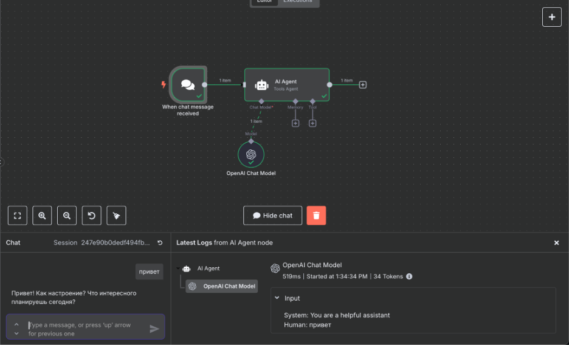
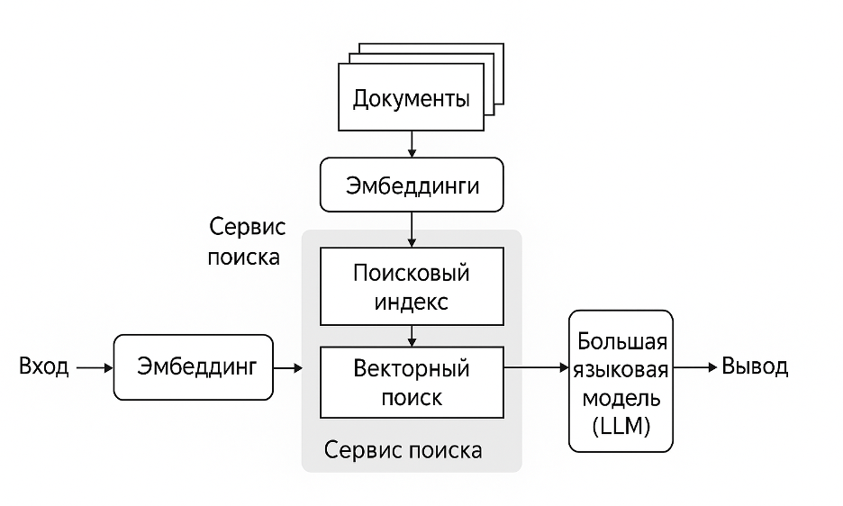

## Твой личный ИИ-агент

В этом проекте ты создашь ИИ-агента, который:

- Поддержит тебя в выборе направления обучения в «Школе 21»;
- Будет присылать регулярный дайджест новых материалов по выбранному профилю;
- Поможет с анализом рынка вакансий и отслеживанием новых требований и компетенций для успешного трудоустройства в будущем;
- Станет твоим проводником в подборе актуальных материалов для выполнения учебных проектов.

Если ты решишь развивать и поддерживать ИИ-агента, он будет сопровождать тебя на протяжении всего образовательного пути в «Школе 21».  
В дальнейшем ты сможешь использовать его для решения любых задач, автоматизации рутины и развития профессиональной экспертизы.

💡 [Нажми сюда](https://oprosso.ru/p/4cb31ec3f47a4596bc758ea1861fb624), чтобы поделиться с нами обратной связью на этот проект. Это анонимно и поможет нашей команде сделать обучение лучше. Рекомендуем заполнить опрос сразу после выполнения проекта.

## Содержание

- [Как учиться в «Школе 21»](#как-учиться-в-школе-21)
- [Chapter I](#chapter-i)
- [Преамбула](#преамбула)
- [Chapter II](#chapter-ii)
- [Задание 1. Знакомство с инструментами](#задание-1-знакомство-с-инструментами)
- [Задание 2. Твой первый ИИ-агент. Выбор специализации](#задание-2-твой-первый-ии-агент-выбор-специализации)
- [Задание 3. Дайджест новостей](#задание-3-дайджест-новостей)
- [Задание 4. Анализ вакансий](#задание-4-анализ-вакансий)
- [Задание 5. Персональный ментор](#задание-5-персональный-ментор)
- [Задание 6. (бонусное)](#задание-6-бонусное)

## Как учиться в «Школе 21»

1. Здесь тебя ждет уникальный образовательный опыт с большим количеством свободы. Ты получаешь задачу и самостоятельно ищешь пути решения, используя любые удобные способы поиска информации - ресурсы Интернета или нейросети (например, GigaChat). Но внимательно относись к качеству информации: проверяй, думай, анализируй, сравнивай.
2. Взаимообучение (Peer-to-Peer, P2P) - это обмен знаниями и опытом с другими пирами, где каждый выступает и учителем, и учеником. Такой подход позволяет глубже понять материал, учась друг у друга.
3. Чувствуй себя свободно и проси о помощи - вокруг тебя те, кто тоже впервые проходят этот путь. Делись своим опытом и идеями с другими. Присоединяйся к RocketChat, чтобы быть в курсе всех новостей от нашего сообщества.
4. Твое обучение не будет иметь никакого смысла, если ты будешь копировать чужие решения. Если пользуешься помощью других - всегда разбирайся до конца, почему, как и зачем. Не бойся ошибиться.
5. Кажется, что задача невыполнима? Сделай перерыв, проветрись, перезагрузи голову - это помогало многим. Возможно, после этого решение придет само собой.
6. Важен не только результат обучения, но и сам процесс. Нужно не просто решить задачу, а понять, КАК ее решить.

Как работать с проектом:
1. Перед выполнением проект необходимо склонировать с GitLab в одноименный репозиторий.
2. Все файлы необходимо создавать в папке *src/* склонированного репозитория.
3. После клонирования проекта необходимо создать ветку develop и вести разработку в ней. После этого пушить в GitLab также нужно ветку develop.
4. В твоей директории не должно быть иных файлов, кроме тех, что обозначены в заданиях.

## Chapter I
## Преамбула

Наверняка у тебя уже был опыт общения с нейросетью: написать текст, придумать идею или объяснить сложную тему *(например, во время участия в отборочном бассейне)*.

В этот момент тебе помогал ИИ-ассистент. Ты - задаешь четкие команды, ИИ - выполняет их одну за другой.

*"Переведи текст с английского на русский" - ИИ переводит.*

*"Напиши план тренировок на неделю для начинающего" - ИИ генерирует список упражнений.*

*"Объясни, как сгенерировать SSH-ключ на Linux" - ИИ объясняет :)*

Ты постоянно управляешь процессом, как senior-специалист, который диктует джуну каждое действие. Эффективно для мелких отдельных задач, но если тебе нужно что-то более комплексное, то процесс работы с ИИ-ассистентом отнимает много времени, т.к. тебе нужно:

- Продумывать каждый шаг самостоятельно.
- Копировать результаты выдачи из одного чата в другой для продолжения работы с ассистентом.
- Постоянно контролировать процесс.

Здесь появляется концепция ИИ-агента. Если ассистент является мощным, но пассивным инструментом, то агент - это уже автономная система, способная действовать в окружающей среде с помощью предоставленных ему инструментов для достижения сложных целей.

В этом проекте ты создашь ИИ-агента, который станет помощником на образовательном пути в «Школе 21», а полученные навыки ты сможешь применять для автоматизации любых задач.

В этом проекте ты научишься:

- развертывать n8n при помощи докера на облачном сервере,
- писать промпты для создания сложного поведения ИИ,
- работать с LLM-моделями через API,
- упаковывать работу ИИ-агентов в пользовательский интерфейс Telegram-бота и поднимать под это инфраструктуру,
- (бонусно) работать с методом RAG

## Chapter II
## Задание 1. Знакомство с инструментами

### Что такое LLM и промпты?

Сегодняшний бум в искусственном интеллекте связан с так называемыми Large Language Models (LLM) - большими языковыми моделями. Их архитектура базируется на особом типе нейронных сетей - трансформерах (как, например, GPT - Generative Pretrained Transformer). Трансформер - это архитектура, основанная на механизме внимания (self-attention), которая позволяет модели эффективно обрабатывать и генерировать последовательности текста, кода и т.п.

Обучение таких моделей проходит в несколько этапов:

- Предобучение (Pretraining): Модель обучается в самообучающемся режиме на огромном корпусе текстовых данных, формируя обобщенное языковое представление.
- Донастройка (Fine-tuning): Модель адаптируется под более узкие задачи на специализированных датасетах (инструкции, диалоги, код).
- Адаптация поведения (например, RLHF - *Reinforcement Learning from Human Feedback*): Модель «доводится» для следования человеческим предпочтениям, чтобы ее ответы были более полезными и безопасными.

В стандартном режиме общение с LLM происходит через промпты (запросы) - инструкции или постановки задач, которые пользователь дает модели. Искусство составления промптов (prompt engineering) напрямую влияет на качество результата.

**Это первое задание посвящено настройке и подключению необходимых инструментов для дальнейшей работы по созданию ИИ-агента.**

1. **n8n**
2. **работа с GigaChat API**

Может показаться логичным и удобным использовать полностью готовый облачный сервис n8n, где не нужно возиться с настройкой. 
Но ключевая цель данного этапа проекта - освоить то, что отличает просто пользователя от IT-специалиста.
Именно этот навык - прочитать документацию, преодолеть проблемы совместимости, настроить окружение и добиться работоспособности сервиса - ты будешь тренировать прямо сейчас.

### a. Подключение и работа с n8n

Для выполнения заданий этого проекта, тебе необходимо развернуть n8n в облачной платформе Cloud.ru.  
Сначала выполни следующие шаги:

1. Зарегистрируйся на платформе [Cloud.ru](https://cloud.ru/) *со своим личным email, привязанным к аппликанту и телефоном*. Процесс регистрации стандартный и интуитивно понятный.
2. После регистрации перейди по [ссылке](https://education.cloud.ru/signup/rLi2Agy9Q4Nyd1LKCyqy4c4RTMs) и введи свои данные, личную почту, привязанную к аппликанту.

Тебя будет ждать автоматически назначенный курс Cloud.ru Evolution Fundamentals по знакомству с облачной платформой. Пройди этот курс, чтобы понять, как функционирует платформа и в дальнейшем ориентироваться при выполнении заданий. Важно сначала завершить курс, и только потом переходить к следующему заданию. 

3. **В рамках этого проекта ты получишь промокод для пополнения счета.**

**Если ты пир волны 25_10 (обучение началось в октябре 2025)**

 - заполни заявку на промокод [по ссылке](https://forms.yandex.ru/u/68f7a874d046880990df5716/) сразу после регистрации на проект. Рассылка промокодов происходит по вторникам каждую неделю (если на вторник выпадает нерабочий день, то рассылка будет в первый рабочий день после вторника). 

Промокод придет на личную почту, привязанную к аппликанту. 

**Если ты пир полны 25_11 (обучение началось в ноябре 2025)** 

 - до 28 ноября 2025 промокод придет на твою личную почту, привязанную к аппликанту. Заявку на промокод заполнять не нужно. 

Если тебе не пришел промокод в обозначенные выше сроки - обратись к АДМ.

4. **Промокод действует до 22.01.2026**. За это время ты сможешь использовать все доступные средства (баллы), чтобы создать и протестировать своего ИИ-агента в рамках этого проекта.  

Активируй полученный тобой промокод по [этой инструкции](https://cloud.ru/docs/billing/ug/topics/guides__promocode). **До 22.01.2026** тебе доступны баллы для работы, после ты сможешь и дальше развивать своего ИИ-агента для сопровождения тебя в обучении, самостоятельно, оплачивая использование.

**Перед работой с сервисами Cloud.ru необходимо подготовить локальное окружение:** 

1. Ознакомься с общей инструкцией по подготовке: [Подготовка рабочего пространства](https://cloud.ru/docs/tutorials-evolution/list/topics/container-apps__before-work?source-platform=Evolution).

Если ты выполняешь проект на компьютере в кампусе, для работы с Docker на компьютере в кампусе ориентируйся на эту инструкцию по установке Docker с переносом данных в goinfre: [Docker install on school iMacs](https://21-school-by-students.notion.site/Docker-install-on-school-iMacs-9354ef106a8a40c6b46a69cea0a11bf8). 

Затем для развертывания n8n тебе нужно проделать следующие шаги:

1. Используй сервис Container Apps. Следуй шагам [этой инструкции](https://cloud.ru/docs/tutorials-evolution/list/topics/container-apps__nocode-telegram-bot) (игнорируй пункты, связанные с Telegram). В ссылках, где скачивается образ n8n, вставь актуальную версию, которую ты определил/-а в п.1.
2. После успешного развертывания открой веб-интерфейс n8n и зарегистрируйся в нем как новый пользователь.

### b. Работа с GigaChat и другими LLM

Для работы с LLM в рамках этого проекта тебе также нужно будет использовать сервисами Cloud.ru - Foundations Models по этой инструкции (игнорируй пункты, связанные с Telegram).

1. Для работы с AI-моделями используй инструкцию: Подключение к [AI-моделям](https://cloud.ru/docs/foundation-models/ug/topics/tutorials__telegram-bot-connection). (игнорируй в этой инструкции все пункты, связанные с Telegram. Тебе нужна только часть, относящаяся к настройке n8n и AI-моделей).
2. В рамках настройки тебе потребуется создать API-ключ, следуя руководству: [Создание API-ключа](https://cloud.ru/docs/console_api/ug/topics/guides__static-api-keys__create?source-platform=Evolution).
2. Внутри n8n создай новый воркфлоу. В узле OpenAI Chat Model выбери модель GigaChat.
3. Внутри n8n собери следующий воркфлоу, напиши в чат "Привет" и получи ответ от LLM.

Мощные LLM, как GigaChat, требуют огромных вычислительных ресурсов. Работа через API позволяет нам использовать их возможности без покупки дорогого железа и сложных настроек, сосредоточившись на логике агента.

**Результат:**

В репозиторий приложи:

1. файл со скриншотом, на котором виден развернутый интерфейс n8n (весь твой рабочий процесс) и на котором виден ответ от модели GigaChat на твой запрос.

## Задание 2. Твой первый ИИ-агент. Выбор специализации

*Ассистент ждет команды ("Посоветуй профессию").*

ИИ-агент проактивен. У него есть цель, и он сам планирует шаги.

Разница в том, что ты не просто пишешь запрос, а создаешь системный промпт: цель, план и правила поведения ("Ты карьерный консультант. Твоя цель - помочь выбрать специализацию. Сделай следующее...") и даешь ему самостоятельно решать, какие вопросы он должен тебе задать.

Именно этот промпт + подключение внешних инструментов и памяти превращает LLM из пассивного ассистента в проактивного агента.

До недавнего времени понятие "агентности" применялось к людям и включало четыре компонента: автономность, рефлексивность, целенаправленность и эффективность. Развитие ИИ-агентов стремится к этим же принципам.

**В этом задании тебе нужно создать Telegram-бот, который задаст тебе вопросы и даст рекомендацию по выбору специализации в рамках выбранного тобою направления обучения (если твое направление "Разработка ПО", то, например, результатом работы бота может быть "тебе больше подойдет бэкенд или фронтенд, на таком-то языке")**

Бот должен задать серию вопросов, и получив на них ответы, выдать рекомендацию.

О чем должен спросить бот:

1. Твой предыдущий жизненный опыт и достижения
2. Опыт прохождения отборочного бассейна (как субъективный опыт, так и объективный, например, данные из датасета-лога:, например, "я вошел в топ-5 среди 100 человек по времени, проведенному за АРМ")

Получить данные ты  можешь по кнопке  “Выгрузить датасет” в своем личном кабинете (ты получишь zip-архив). 

3. Твой возраст, место проживания
4. Твои интересы и любимые занятия
5. Цели обучения и желаемая скорость их достижения
6. Сильные и слабые стороны (по твоему мнению)
7. Желаемый формат работы (удаленно/оффлайн), размер компании

- Создай Telegram-бот через [@BotFather](https://t.me/BotFather) и получи его token.
- Поведение бота реализуй внутри n8n через:
  - триггер Telegram,
  - AI-агента, добавив к нему узел GigaChat Model и узел SimpleMemory (для хранения контекста переписки конкретного юзера с ботом). Используй модель GigaChat 2.

Твоя задача собрать необходимый воркфлоу в n8n, добавить требуемые узлы, настроить их и написать системный промпт (system message) в узле AI Agent (именно он и превращает LLM в агента).

**Защита данных и риски**

Ты используешь внешние API (GigaChat). Любые данные, которые ты им отправляешь, могут логироваться на их стороне.

- Не отправляй конфиденциальную информацию (пароли, имена, внутренние данные проектов).
- Старайся анонимизировать и обезличивать данные перед отправкой. Вместо «Я, ФИО, оказался в топ 5% по времени, проведенном за АРМ» отправляй «По данным метрик, продолжительность моей работы за АРМ превышает показатели 95% пользователей». Убирай любые прямые идентификаторы.

**Результат:**

В репозитории приложи:

1. json-файл, в котором экспортирован твой воркфлоу в n8n,
2. pdf-документ, в котором приложены скриншоты финального взаимодействия с ботом и его рекомендации,
3. Файл task3.txt, где опиши ответы на вопросы (краткие ответы):

1. Какие ключевые элементы и правила соблюдены в твоем системный промпте?
2. Как они обеспечивают успешную работу промпта в воркфлоу?
3. Почему именно эти элементы были важны?

## Задание 3. Дайджест новостей

Как уже было сказано, если взглянуть под капот, то ИИ-агент - это такая же LLM, которой просто дали возможность пользоваться в нужные моменты соответствующими инструментами: поиском в интернете, другой LLM (создавая мультиагентные структуры), календарями, почтами, инструментами разработки, памятью и др.

Чтобы сегодня создать ИИ-агента нужно каким-то образом:

- подключить LLM к некоторому набору инструментов,
- эти инструменты описать: что они делают, какой формат данных принимают на вход,
- указать, в каких случаях каким инструментом стоит пользоваться.

Современным стандартом для такого подключения является протокол Model Context Protocol (MCP), предложенный компанией Anthropic. Это протокол для стандартизованного обмена контекстом и инструментами между моделями и внешними системами. Благодаря MCP для любого приложения можно создать сервер, дающий через LLM еще один интерфейс - помимо GUI, где пользователь что-то накликивает и вызывает - интерфейс, где можно просто словами описать необходимую задачу, а LLM сможет это интерпретировать в функции и команды этого приложения.

**В этом задании ты научишься настраивать автоматическую рассылку дайджестов новостей по твоей специализации из Telegram-каналов.**

- Создай новый приватный Telegram-канал и получи его Chat ID.
- Найди минимум 3 Telegram-канала по специализации, рекомендованной в предыдущем задании. Из них должны парситься посты (для этого можно воспользоваться одним из бесплатных сервисов для превращения Telegram-канала в RSS, например, [этим](https://fetchrss.com/)). RSS необходим в качестве прослойки, так как ты не сможешь напрямую парсить публичный Telegram-канал, если ты не являешься его админом.
- В n8n собери воркфлоу, который при помощи AI-агента превращает посты в формат дайджеста и присылает дайджест 1 раз в день в твой приватный Telegram-канал.

Форма дайджеста должна выглядеть так:

1. Общее саммари о постах в одном абзаце.
2. Название канала - количество постов
   1. пост 1: краткое описание, ссылка
   2. пост 2: краткое описание, ссылка
3. Название канала - количество постов
   1. пост 1: краткое описание, ссылка

- В качестве AI-модели используй GigaChat-2 для суммаризации отдельного поста и ее же для общей суммаризации всех появившихся постов.

**Результат:** в репозитории приложи json-файл, в котором экспортирован твой воркфлоу в n8n, а также pdf-документ, в котором виден результат работы воркфлоу в Telegram.

## Задание 4. Анализ вакансий

**В этом задании тебе нужно настроить парсинг вакансий и автоматическое выделение ключевых требований, чтобы получать еженедельный отчет с актуальными навыками с рынка труда.**

В n8n создай новый воркфлоу, в рамках которого твой ИИ-агент будет:

- Раз в неделю парсить новые вакансии в HH.ru через API по выбранному тобой направлению в нужном тебе регионе.
- Выделять среди подобранных вакансий ядро компетенций при помощи AI-агента на GigaChat - топ-15 самых частых навыков и требований.
- Присылать подборку в формате дайджеста в твой приватный Telegram-канал (созданный в предыдущем задании).

Форма/сценарий дайджеста должна выглядеть так:

*На этой неделе я спарсил N свежих вакансий по выбранному тобой направлению. Самыми популярными являются следующие требования:*

- *требование 1: количество раз*
- *требование 2: количество раз*
- *требование 3: количество раз*
- *…*

- Для извлечения навыков из описания вакансии используй самую простую модель GigaChat 2, для выявления самых популярных навыков - ее же.
- Более точные результаты будут, если навыки, описанные в вакансии, приводить к единому нормативному виду: python/питон -> python.
- На этапе разработки, тестирования и дебага ограничивай количество вакансий до 3, иначе можно потратить слишком много токенов. Если бот ведет себя неадекватно, улучши свой системный промпт, сделай инструкции еще более четкими (контроль качества).

Когда есть уверенность, что весь воркфлоу работает, как надо, можешь поднять до 10 для увеличения выборки.

**Результат:**

В репозитории приложи json-файл, в котором экспортирован твой воркфлоу в n8n, а также pdf-документ, в котором виден результат работы воркфлоу в Telegram.

До этого момента твой агент работал с твоими личными данными и публичной информацией. Теперь ему предстоит решать более серьезную задачу - анализировать данные с рынка труда.

Выводы агента могут повлиять на твое карьерное планирование: какие языки учить, какие технологии осваивать. Цена ошибки здесь уже высока.

В корпоративной среде подобные системы используются для HR-аналитики, планирования обучения сотрудников и стратегического развития. И именно здесь на первый план выходят ключевые риски применения ИИ, которые тебе необходимо учитывать как инженеру.

**Почему слепое доверие ИИ - это риск?**

**Стохатичность (случайность) LLM**

Основной риск заключается в том, что LLM не дает предсказуемых результатов, как это, например, происходит в стандартной программе, у которой под капотом код. Такая стандартная программа является жесткой конструкцией. Да, у нее могут быть неочевидные баги, но это связано с ошибками при проектировании, описании сценариев и непосредственного написания кода. Код в абсолюте можно привести к предсказуемому поведению.

LLM же обладает стохастикой и может давать иногда слегка отличающиеся ответы, а иногда и сильно другие (вести себя неадекватно).

Доверять такому агенту принятие стратегических решений без контроля - опасно.

**Корпоративные риски:** представь, что такой агент имеет доступ к внутренней базе вакансий компании. Случайная передача этих данных внешнему API (как GigaChat) может привести к утечке коммерческой тайны. Кроме того, ошибка в анализе (например, неверное определение тренда на навыки) может привести к финансовым потерям.

## Задание 5. Персональный ментор

**В этом задании ты создашь бота, который будет составлять для тебя учебный план и присылать посты с полезной информацией по желаемой теме.**

В n8n создай новый воркфлоу, по которому твой ИИ-агент:

1. Задает вопрос: "Чему бы ты хотел научиться" в рамках работы над текущим учебным проектом или в рамках подготовки к собеседованию и трудоустройству, уточняет уровень владения темой и ждет ответ пользователя.
2. Опираясь на ответ пользователя, AI формирует контент-план в виде списка тем для изучения. Каждая тема содержит в себе перечень основных понятий.

Тема 1: [понятие 1, понятие 2, понятие 3...]

Тема 2: [понятие 1, понятие 2, понятие 3...]

3. После того как план обучения готов, бот получает подтверждение от пользователя, и далее присылает пользователю небольшие посты, освещающие понятия тем. Каждый раз - про один из пунктов этого плана.
4. Бот отправляет посты без повторов. Если тема уже была, он не станет присылать пост на эту тему снова.
5. После полного прохождения всех запланированных тем бот спрашивает, что пользователь хочет изучать дальше.

- Для сохранения плана обучения, а также сохранения метки, какое из понятий уже было опубликовано, используй Static Data в n8n.
- Для создания контента под пост AI Agent должен использовать tool с tavily_search. Для этого нужно на нем пройти регистрацию и получить credentials. Агент будет делать поиск в интернете и из найденных материалов готовить контент.
- Для создания плана обучения и создания поста используй модель GigaChat 2.

**Результат:**

В репозитории приложи json-файл, в котором экспортирован твой воркфлоу в n8n, а также pdf-документ, в котором виден результат работы воркфлоу в Telegram.

## Задание 6. (бонусное)

LLM-модели часто дают не совсем релевантные ответы, если контекст специфичен и содержит внутренние правила или данные компании, недоступные в интернете.

Для решения этой проблемы используется метод RAG (retrieval augmented generation) - генерация ответа по результатам поиска в текстовых источниках. Это популярный кейс и востребованный навык, а на рынке может появиться новая профессия - RAG-инженер.

Это задание бонусное, оно поможет тебе освоить базовую механику RAG и результаты применения этого метода в работе ИИ-агента.

Твой ИИ-агент будет выбирать наиболее подходящую для тебя вакансию из нескольких на основе анализа твоего резюме и личностного опросника.

**Любой RAG состоит из двух частей (или этапов):**

1. Загрузка и подготовка *текстовых* данных.
2. Непосредственный поиск релевантных источников и генерация.

**Этап 1**

- На этапе загрузки и подготовки очень важно тщательно подготовить текстовые данные с точки зрения того, чтобы в них действительно была вся актуальная, точная и релевантная информация, причем во всех возможных вариантах написания.

Например: peer-to-peer, p2p, peer-2-peer, пиртупир, пир-ту-пир, п2п. Если их не будет в самом исходном документе, то на этапе поиска и генерации ничего релевантного не найдется.

- Далее нужно разбить документ на «чанки» или параграфы (фрагменты). Именно эти кусочки документа идут дальше в «оцифровку» через эмбеддинги.

Эмбеддинг - тоже модель, которая создает векторное представление текста: она превращает слова, фразы и предложения в набор чисел - вектор. Когда ты подаешь свой параграф на вход такой модели, она возвращает вектор - числовую форму этого текста в векторном пространстве эмбеддинга.

У каждой модели эмбеддингов (самостоятельно изучи, какие модели бывают) - свое собственное векторное пространство, поэтому один и тот же текст при преобразовании разными моделями будет получать разные векторные представления.

- После того как все параграфы преобразованы через эмбеддинг-модель, эти векторы сохраняются в векторную базу данных.

**Этап 2**

- Когда ты добавляешь документ и задаешь к нему вопрос, система обрабатывает его тем же способом: преобразует твой текстовый вопрос в вектор с помощью той же эмбеддинг-модели. На выходе будет опять же вектор, состоящий из чисел.

Затем специальный механизм - ретривер - ищет подходящие фрагменты текста сравнивает вектор твоего вопроса с векторами всех чанков в базе, вычисляет степень их близости и выбирает топ-N наиболее подходящих фрагментов. Именно эти фрагменты передаются в LLM для генерации ответа на их основе.

- Если ретривер не нашел релевантных фрагментов, LLM будет вынуждена "додумывать" ответ на основе собственных знаний, что часто приводит к "галлюцинациям" модели и недостоверным результатам.

**Поэтому для создания качественной RAG-системы очень важно:**

- тщательно готовить исходные документы
- правильно разбивать текст на "чанки"
- использовать качественные эмбеддинг-модели
- настраивать параметры поиска и генерации (на каком количестве документов LLM должна строить ответ и, конечно же, выбор самой LLM-модели)

В общем, есть много нюансов, и сейчас на практике ты сможешь протестировать этот подход.

**Реализуй в n8n базовую RAG-систему,** состоящую из двух частей:

- В первое хранилище загрузи 4-5 PDF-документов с описаниями вакансий разного профиля: по одной на каждый профиль (например, с HH.ru: разработчик, аналитик, UX-дизайнер и т.д.)
- Во второе хранилище добавь свое резюме и результаты личностного опросника о твоем потенциале и сильных чертах в PDF-формате (пройти опрос и получить результаты ты можешь, используя [этот](https://www.gptbots.ai/s/csWnj5nS) ИИ-помощник).

Инструкция по реализации:

1. Для загрузки PDF-файлов с компьютера используй соответствующий узел в n8n
2. Для дальнейшей загрузки документа в векторное хранилище используй узел Simple Vector Store.
3. В качестве эмбеддингов удобно использовать Hugging Face API (потребуется бесплатная регистрация и получение API токена) и модель [ru-en-RoSBERTa](https://huggingface.co/ai-forever/ru-en-RoSBERTa).
4. Для генерации ответов подключи модель GigaChat 2.
5. Настрой узел On chat message в качестве триггера, для того чтобы задать свой вопрос.
6. Проверь качество ответа, сравни с ожиданиями и устрани проблемы, если ответ не релевантен.

**Результат:**

В репозитории приложи json-файл, в котором экспортирован твой воркфлоу в n8n, а также pdf-документ, в котором виден результат работы воркфлоу в n8n (в документе видны заданный вопрос и полученный ответ).

💡 [Нажми сюда](https://oprosso.ru/p/4cb31ec3f47a4596bc758ea1861fb624), чтобы поделиться с нами обратной связью на этот проект. Это анонимно и поможет нашей команде сделать обучение лучше. Рекомендуем заполнить опрос сразу после выполнения проекта.